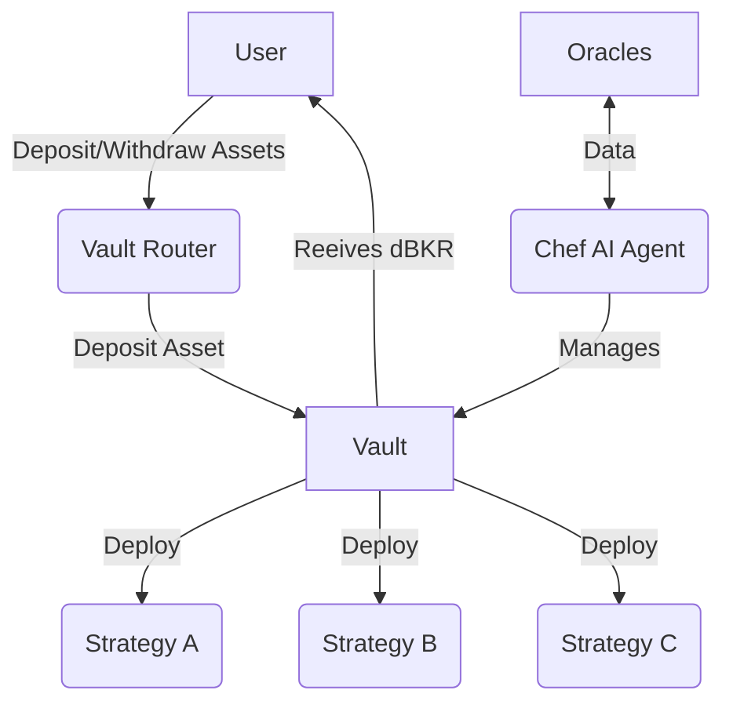

# Architecture

The protocol implements a **modular and extensible architecture** designed to optimize DeFi investments through AI-driven automation. At its core, the system consists of smart contract vaults that manage assets, **AI Agents (Chefs)** that make strategic decisions, and various supporting components that enable seamless interaction and execution of investment strategies on our network of vaults on behalf of the users.

## Key Components

### Vault (ERC-4626) 📦
A vault is a unique **ERC-4626** compliant pool that manages assets that are deployed on a specific chain. It is used to manage a single or multiple strategies and could also be managed by a a chef to optimize the performance of the strategies.

The purpose of a vault smart contract is to deploy specific strategies to maximize the yield or returns generated by the assets held within the vault. This is a destination smart contract where the users deposit their assetss and receive a share of the pool that represents their ownership of the assets within the vault.

A **share of the pool** is an **ERC-20 Token (transferable)** and could be used later to withdraw their owned amount of the pool that could contain (Assets + Yield). This vault could use a set **Strategies** to deploy capital and possible harvest a yield.

The Vault operation is optimized by our Chefs that are the ones that optimize the operations of vaults and strategies under management.

### Strategies (Recipes) 🍰
Strategies are the individual investment strategies that belongs to a vault. They are the ones that perform the actual investment operations.

A **Strategy contract** implements could be used to deploy an asset over a predifined sequence of operations to maximize the yield or returns generated by the assets held within the vault.

The Strategy could be for the user to interact with :

- Deploy a Leverage Position
- Deploys assets on certain liquidity pools (Ex: Uniswap LP)
- Supply or Borrow from a Money Market.
- Deploy assets on Specific DeFi Protocols (Ex: Aave, Compound, etc)
- Park Tokens for Derisk or Arbitrage Strategies

### Vault Router 🚏
The vault router is the entry point for users/chefs to interact with the vault infrastructure. It allows users to deposit and withdraw assets in or between protocols convert assets and interact at high level with the deployed vaults on a specific chain.

The Router design is inspired by the Uniswap Router Multicall was devised to be a programmable interface that allows platform users to interact with the vaults in a flexible and efficient manner enabling the platform to be extended and optimized by our agents in a modular and extensible way.

A Router per chain is deployed  allows the users to interact with all the vaults controlled by the protocol and making the asset conversion between vaults a seamless experience.

### Chefs (AI Agents) 🧑‍🍳
**This is intelligence layer of our protocol**. Chefs are the AI agents that are responsible for managing the strategies and the vaults. they are the ones that make the investment decisions and execute the rebelances and make the system to work in a efficient way.

Chefs utilize external data sources to gather critical market information, enabling them to analyze risks and make informed investment decisions. By continuously monitoring market conditions, they can effectively rebalance and optimize vault operations. This process ensures that the investments are managed securely and efficiently, adapting to changing market dynamics while safeguarding user assets.

:::tip
The **Chefs** are trained and with historical data to make better decisions using **Deep Reinforcement Learning** algorithms, taking into the account all the market paramters monitored by the system. All the operations executed by the agents are recorded and stored in the blockchain to be auditable and transparent.
:::

### Oracles 👂

Oracles are the sources of data that are used by the chef, strategies and vaults to load the data from external data sources.
Oracles are a crucial component of the BakerFi protocol, their primary responsibility is to provide up-to-date token prices and data to our smart-contracts and agensts. Our protocol rely on this precise information for proper and healthy strategy operation and function.

