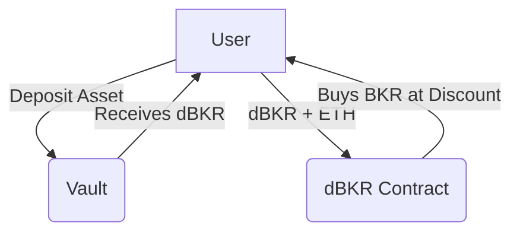

# Vault Incentives

Our innovative Vault incentives system rewards users based on the **Total Value Locked (TVL)** they provide to our yield vaults. The more TVL you contribute, the more **dBKR** tokens you earn over time. This reward mechanism is designed to directly correlate with your investment, meaning that larger contributions not only yield more tokens but also enhance your overall earning potential. This structure encourages users to maximize their contributions, fostering a more robust and engaged community while simultaneously driving the growth of the BakerFI ecosystem.

Certain vaults offer **boosted dBKR distribution** over a specific time window, amplifying your rewards and incentivizing strategic participation on promoted vaults. The boost on certain vaults are controlled by the DAO members and could change over time to promote a vault during its deployment cycle.

## What is dBKR? 🤔
**dBKR** is a derivative token  that unlocks exclusive opportunities to purchase **BKR** at a discount. This system not only enhances your yield-earning potential but also provides additional value and flexibility in maximizing your rewards within our ecosystem.

### dBKR Minting

The **dBKR minting** takes place weekly at 12:00 AM UTC, factoring in all vault positions and the current vault share prices across chains where the BakerFI is deployed. The tokens are minted directly to depositors on **Base Chain** depositors wallet addresses, ensuring seamless and accurate and transparent rewards allocation.

### dBKR Discounts

To incentivize vault participants , **10% of the total token supply** (50M BKR) is allocated to a dedicated selling contract, enabling users to buy **BKR** tokens at a discount using **dBKR** obtained from investing on BakerFI Recipes (Vaults). The effective price for purchasing **BKR** is calculated based on the following formula:

$$
\text{EffectivePrice} = \text{MP} - \left(\text{MP} - \text{FP}\right) \times \frac{\text{dBKR}}{\text{maxdBRK}} \times \text{MaxDiscount}
$$

**Explanation:**

- **MP** (MarketPrice): Current market price of the **BKR** token.
- **FP** (Floor Price): The minimum price below which the token cannot be discounted.
- **dBKR** (The dBRK Provided): The amount of **dBKR** tokens the user chooses to exchange.
- **MaxBKR** (Max BKR Allowed Per Buy): The total number of **BKR** tokens eligible for discounts in the contract.
- **MaxDiscount**: The maximum discount percentage that can be applied to the token price.

:::tip
This mechanism ensures a fair and dynamic pricing model, rewarding active participants while maintaining the protocol’s tokenomics integrity.
:::

### Discount Protection

The **FloorPrice** acts as a safeguard in our discount mechanism, ensuring that the price of **BKR** never falls below a predetermined minimum, regardless of the applied discount.

While the formula dynamically adjusts the **EffectivePrice** based on the provided **dBKR** and other parameters, the FloorPrice prevents excessive discounts from driving the price lower than this threshold.

This mechanism achieves two critical objectives:

1. **Price Protection**: It maintains the intrinsic value of **BKR**, ensuring stability in the ecosystem.
2. **Balanced Rewards**: Users still enjoy meaningful discounts up to the **MaxDiscount**, but within limits that protect the protocol’s tokenomics.